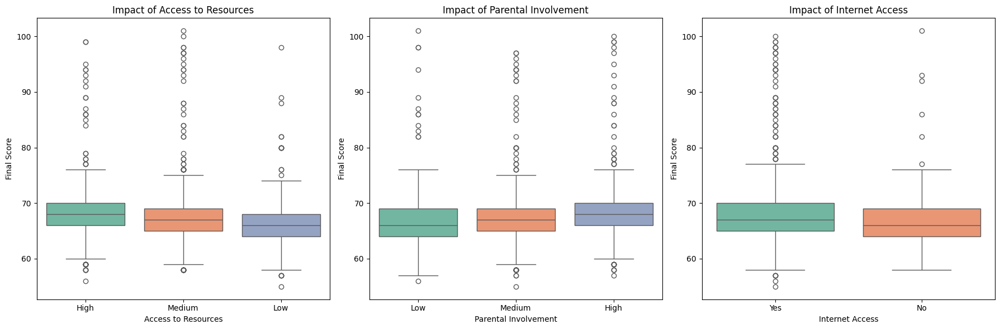
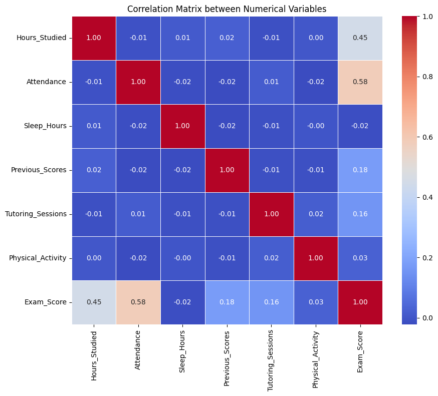
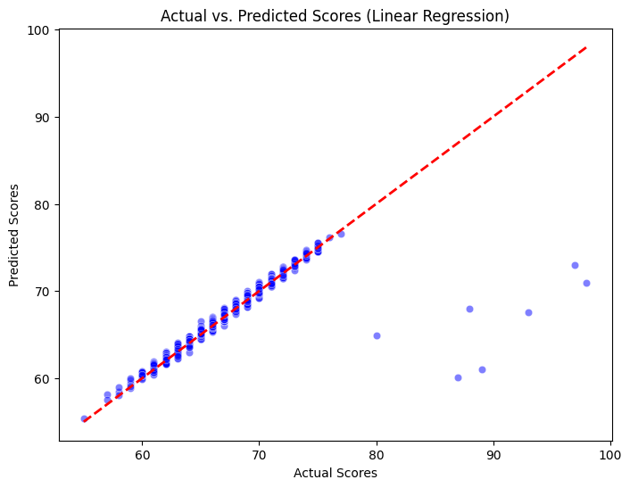

# 🎓 Student Performance Analysis & Prediction


## 📄 Project Overview
This project aims to analyze the factors influencing student performance and build a predictive model to estimate final exam scores. Using a dataset containing academic, social, and demographic variables, we investigated the impact of study habits vs. socioeconomic background.

The project follows a complete Data Science lifecycle: **Data Cleaning**, **Exploratory Data Analysis (EDA)**, **Hypothesis Testing**, and **Machine Learning Modeling**.

---

## 💡 Key Insights & Findings

During the exploratory analysis, we discovered several critical patterns.

### 1. The Power of Habits over Background
Our initial hypothesis tested the impact of socioeconomic factors versus individual study habits.

* **Attendance is King:** With a correlation of **0.58**, class attendance proved to be the strongest predictor of success.
* **Effort > Privilege:** Variables like **Hours Studied** showed a strong positive correlation, while socioeconomic factors (Family Income, Internet Access, Access to Resources) showed **little to no differentiation** in the median final score in this specific dataset.


*Figure 1: Boxplots showing little variation in median scores across different levels of resources, parental involvement, and internet access.*

### 2. Correlation Analysis
A heatmap revealed the strongest numerical relationships with the target variable (`Exam_Score`).


*Figure 2: Heatmap highlighting 'Attendance' (0.58) and 'Hours_Studied' (0.45) as the strongest predictors.*

---

## 🤖 Machine Learning Model

We trained a **Linear Regression** model to predict the final `Exam_Score`.

* **Target Variable:** Exam Score (0-100)
* **Features:** 27 variables (including encoded categorical data).
* **Train/Test Split:** 80/20.

### Model Performance
The model achieved excellent results for human behavioral data, indicating that student performance is highly predictable based on the provided variables.

| Metric | Score | Interpretation |
| :--- | :--- | :--- |
| **R² Score** | **0.77** | The model explains **77%** of the variance in scores. |
| **MAE** | **0.45** | On average, predictions deviate by less than **0.5 points**. |

### Actual vs. Predicted Scores
The visualization below shows the model's accuracy on the test set. Points closer to the red dashed line indicate more accurate predictions.


*Figure 3: The strong linearity along the red diagonal confirms the model's robustness across different score ranges.*

---

## 🛠️ Technologies Used
* **Language:** Python
* **Data Manipulation:** Pandas, NumPy
* **Visualization:** Matplotlib, Seaborn
* **Machine Learning:** Scikit-Learn
* **Environment:** VS Code / GitHub Codespaces

---

## 🚀 How to Run
1. Clone the repository:
   ```bash
   git clone [https://github.com/SEU-USUARIO/student-performance-analysis.git](https://github.com/juanplima12/studentperformance.git)
